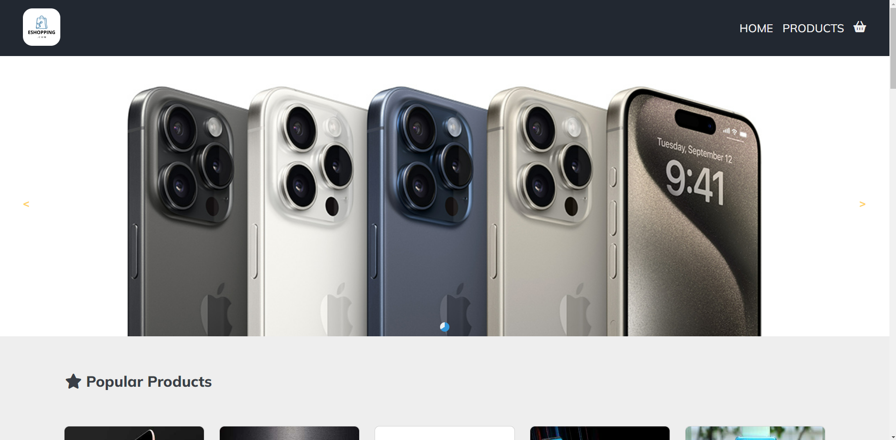
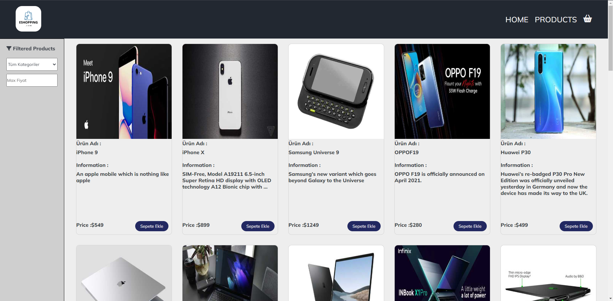
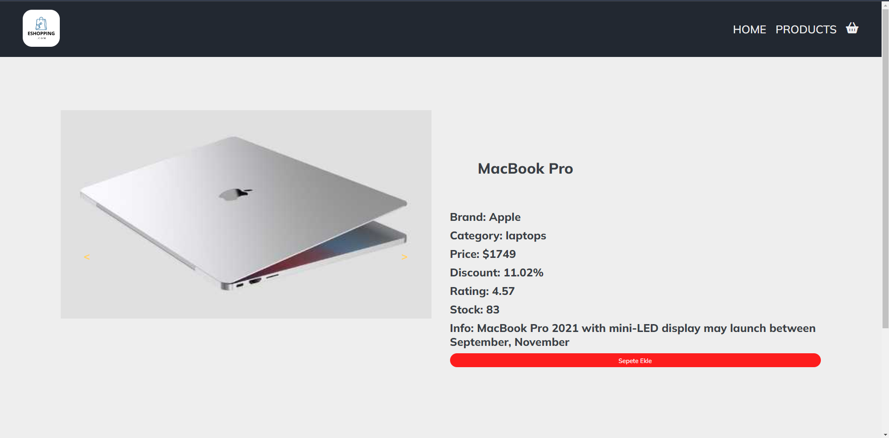
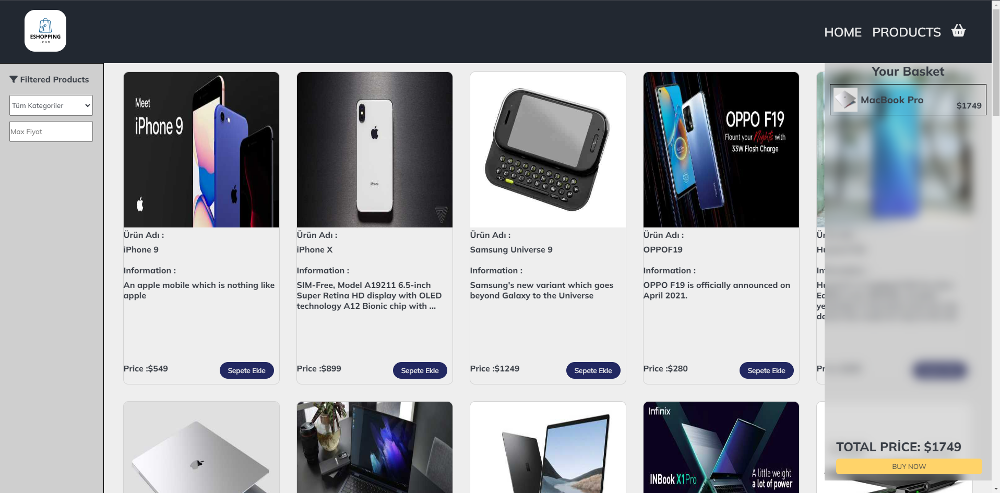

🚀 React ve JavaScript ile geliştirdiğim online alışveriş uygulamasının lansmanını heyecanla duyuruyorum! 🎉  
🔗 Uygulamayı görmek ve denemek için [buraya tıklayabilirsiniz]().  
📚 Bu uygulama, kullanıcıların istekleri doğrultusunda ürünleri filtre ederek arayabilecekleri, istedikleri ürünlerden bir alışveriş sepeti oluşturabilmesini sağlıyor.  
🔍 RestAPI ile aldığım API'yi Axios mükemmel bir şekilde yönetti. 
🔄 State yönetimi için Context API kullanarak verileri yönettim, bu da uygulamanın verimliliğini artırdı ve kod karmaşıklığını azalttı. 
💅 Ek olarak, CSS modülleri uygulamanın estetiğini artırmada kritik bir rol oynadı, görsel olarak çekici ve kullanıcı dostu bir deneyim sunarak. 
👨‍💻 Bu projeyi paylaşmaktan heyecan duyuyorum ve geri bildiriminizi bekliyorum! 

